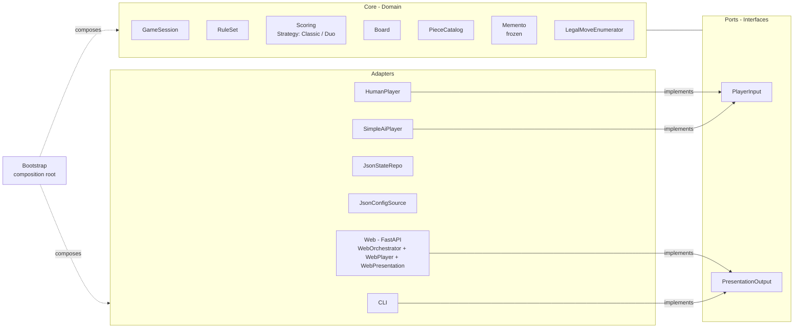

# Team_Summary.md

> **Team Project Summary**
> _1-2 page overview of the team's project, AI usage, and key results._

---

## Team Information

**Team Name:** `Team 2`\
**Project:** Blokus Game Engine (Classic + Duo)\
**Team Members:** `Iven Beck, Petar Malamov, Denis Maxheimer, Richard Plummer`

---

## Project Scope & Architecture

### Overview

Python implementation (build backend: `hatchling`, dependency/runtime: `uv`) of the Blokus board game. Milestone 1 delivered Classic Blokus (4 players, 20×20 board, corner starts); Milestone 2 added the Blokus Duo variant (2 players, 14×14 board, interior starting cells, all-pieces-placed bonus with tie co-winners) as a configurable extension without forking the engine. The engine exposes both a CLI (`blokus-engine`) and a FastAPI-based browser GUI (`blokus-engine --gui`), supports JSON save/load via a `Memento`, and ships a deterministic `SimpleAiPlayer` for human-vs-AI and AI-vs-AI play. 180 tests pass on the integrated branch (`uv run pytest`).

### Architecture Diagram

Hexagonal (Ports & Adapters) per binding decision `ADR-FINAL-P2` (Strategy + Command + Builder + Memento). Adapters implement ports declared by `Core`; `Bootstrap` is the procedural composition root.

### Key Components

1. **Core Domain:** `GameSession`, `RuleSet`, `Scoring` (Classic + `DuoScoring` strategies), `Board`, `PieceCatalog`, frozen `Memento`, `LegalMoveEnumerator`. Holds all game rules and state; never imports adapters.
2. **Ports:** Two main interfaces — `PlayerInput`, `PresentationOutput` — declared in `Core`.
3. **Adapters:** `CLI`, `WebOrchestrator` (FastAPI: `/state`, `/move`, `/pass`, `/health`, `/piece-catalog`, `/reset`) + `WebPlayerAdapter` + `WebPresentationAdapter`, `JsonStateRepo`, `JsonConfigSource`, `SimpleAiPlayer`, `HumanPlayer`.
4. **Bootstrap:** Procedural composition root (`src/bootstrap.py`) wiring config → ports → adapters → `GameSession`. Single args-based CLI with `--gui`, `--duo`, `--help` flags.
5. **Test Suite:** 180 passing tests under `tests/core/` and `tests/adapters/`, including `test_config_vo_literals.py` (DR-1 tripwire), `test_duo_game.py` (Duo determinism), `test_scoring.py` (bonus + co-winners), and `test_web_orchestrator.py` (HTTP contract).

---

## AI Tools Used

### High-Level Overview

| Phase                 | AI Tool / Model               | Usage                                                                                                                   | Validation Method                                                                              |
| --------------------- | ----------------------------- | ----------------------------------------------------------------------------------------------------------------------- | ---------------------------------------------------------------------------------------------- |
| Requirements          | Claude Sonnet 4.6             | Ambiguity detection on SPEC.md (8 AMBs surfaced); SPEC v2 rewrite with resolutions embedded                             | Manual team review against Mattel BJV44 rulebook                                               |
| Requirements          | MiniMax-M2.7 (plan mode)      | SRS baseline `SPEC_M1.md`                                                                                               | Cross-check resolved AMB IDs into spec                                                         |
| Requirements          | OpenCode CLI + GPT-5.5        | Persona-driven functional/non-functional requirements                                                                   | Human review of persona influence; baseline comparison                                         |
| Architecture / ADR    | Claude Opus 4.7 (Claude Code) | Three-persona `ARCHITECTURE_PROMPT_v1.md`; binding `ADR-FINAL-P2` (DS-hexagonal-2); `AGENTS.md` minimal context file    | Drift-risk tripwires DR-1…DR-7; DR-1 and DR-3 enforced by tests                                |
| UML                   | Gemini 3 Flash                | v1 Mermaid class diagram from ADR; LLM-as-Judge validation against five-criterion rubric; v2 corrections                | Separate validator session; criteria scoring; manual ADR/FR cross-check                        |
| Coding (M1 Core)      | MiniMax-M2.7 (opencode CLI)   | Subagent-driven TDD orchestrating 17 atomic tasks; reviewer-turn subagent on diffs                                      | `uv run pytest` (65 tests at Task 16), `ruff`, `mypy`, reviewer-turn for silent hallucinations |
| Coding (Web GUI)      | Claude Opus 4.7               | Web GUI spec + implementation plan; `/frontend-design` UX redesign pass                                                 | Adapter pytest suite + manual browser smoke test                                               |
| Coding (Duo M2)       | Claude Opus 4.7               | Duo design + plan + execution via brainstorm → write-plan → execute-plan; Duo GUI guardrails                            | RED→GREEN per step; FastAPI `TestClient` probes of `/state`; full suite 180 passed             |
| Coding (GUI gameplay) | OpenCode + GPT-5.5            | Move-safety remediation, hover preview, end-game table, `/piece-catalog`, `/reset`, CLI player count                    | `uv run pytest`, focused adapter tests, manual diff review                                     |
| Maintenance           | Cursor 3.4.20                 | `pyproject.toml` migration to Hatchling; single args-based CLI entry point                                              | `uv sync && uv run blokus-engine --help`; CLI smoke                                            |
| Code Review           | Gemini 3 Flash                | G3 (with/without authority-cue comments) on `rule_set.py`; G4 (persona + pseudocode + chain-of-thought) on `scoring.py` | Manual source-trace of every finding to separate real bugs from hallucinations                 |
| Debugging             | OpenCode + GPT-5.5            | Explain-Then-Fix and AutoSD loops for turn-flow, CLI alignment, piece/orientation bugs                                  | Targeted pytest, endpoint smoke, static UI checks                                              |
| Merge                 | OpenCode + GPT-5.5            | Staged-pipeline resolution of the GUI ↔ Duo branch conflict                                                             | `uv build`, full pytest (176 passed pre-Duo-tests), `git diff --cached --check`                |

### AI Usage Policy

| Policy / Guideline         | Description                                                                                              | Application                                                                                         |
| -------------------------- | -------------------------------------------------------------------------------------------------------- | --------------------------------------------------------------------------------------------------- |
| Disclosure via prompt logs | Every AI-assisted session is captured in `prompts/<owner>_<task>.{json,md}` and committed alongside code | Visible in `OWNERSHIP.md` evidence column for every work package                                    |
| Human review before commit | No AI-generated diff is committed without a developer reading the full diff first                        | Used across Core/M1, Web GUI, Duo, debugging, and merge work (see Iven, Denis, Petar portfolios §4) |

---

## Key Results

### What Worked Well

- **Configuration-as-data + Strategy seams** made Blokus Duo a no-fork extension: a new `scoring_rule` config value + `DuoScoring` strategy + threading `last_placed_piece` through the `Memento` — `Core` never references "Duo" by name.
- **`AGENTS.md` minimal context file** propagated architectural invariants (no `Core.*`→adapter imports, no hard-coded `20`/`4`, Memento round-trip JSON-only) across 30+ commits without re-derivation.
- **Reviewer-turn subagent on the diff** (not on the tests) caught silent hallucinations in `GameSession`, `Memento`, and `StateRepository` that all 45 author-supplied tests had passed (see Counterexample 1).
- **Two-phase G3/G4 review** surfaced two real critical bugs: `is_first_move` unverified for players 2–4 in `check_legality`, and the inverted leaderboard in `DuoScoring.rank` from double-negation.
- **Backend-frontend separation + a dedicated UX-reflection prompt** turned a functional-but-unplayable first GUI pass into a Swiss/editorial redesign in one round (`/frontend-design`).
- **Persona-driven requirements** (Ethan, Priya, George) captured learnability/accessibility/save-load needs a purely technical brief would have missed.

### What Failed or Was Challenging

- **`AGENTS.md` drifted**: line still said "Duo is out of scope" after the Duo milestone shipped, and the dual-language ("Java or Python") section persisted until manually rewritten.
- **Author-supplied tests doubled as both spec and validator** — three critical defects in `GameSession`/`Memento`/`StateRepository` survived a green test suite (Counterexample 1).
- **Broad remediation prompts produced over-refactoring** of working code beyond the requested bug fixes (Counterexample 3).
- **Static GUI tests** assert file content (`gui.js` contains `refreshStartOptions`) but cannot prove that a Duo seat-3/4 button is actually un-clickable in a browser.
- **Authority-cue comments triggered overcompensation, not suppression**: the model hallucinated a critical finding on a `# flawless`-marked method rather than skipping it.
- **Functional acceptance criteria underdelivered for UX work**: "user can POST `/move` and get 200" was met by a generic dark "gamer" UI that was nonetheless unplayable.

### Lessons Learned

- Author-supplied tests are a _specification_ to the LLM; they cannot also be the _validator_. A separate reviewer turn that consumes the diff plus FR IDs is the load-bearing step.
- Constraints that are falsifiable by code must either become an executable tripwire (DR-1 literal scan in `CODING_PROMPT_v1`) or be deleted in the same PR that invalidates them — manual prose drifts within a single milestone.
- Configuration-over-forking refunds its ADR cost at the next milestone: adding Duo cost data + one Strategy, not a parallel engine.
- Feeding multiple documents or scopes into a single LLM session without specific boundary constraints can causes the model to lose focus. The false positive in the ambiguity detection exercise (AMB-03) would have been avoided entirely by scoping the prompt to one document at a time.
- Multi-model routing by task type (MiniMax for planning/Core TDD, Claude Opus 4.7 for UX + Duo, OpenCode + GPT-5.5 for GUI gameplay/debugging, Cursor for single-file maintenance, Gemini Flash for review/UML) worked very well in team's experience because it allowed for leveraging each Models particular strengths.

---

## Top 3 Counterexamples

1. **Counterexample 1:** `Silent hallucinations in Tasks 6–8 — tests pass, code wrong`\
   **Link:** `deliverables/Portfolio_Iven.md` Counterexample 1; commit `67397aa`; `prompts/iven_coding_subagent_tasks_6_8_issue_fix.json`\
   **Guideline that Failed:** Topic 3 — Testing, Team 3 · G1+G2 ("Define the Testing Objective + Structured Test Prompts")\
   **What Happened:** All 45 author-supplied tests went green, but `GameSession.consecutive_passes` was never incremented (no `submit_pass()`); `StateRepository.save()` took the live session, bypassing the `Memento`; and the "frozen" `Memento` held a mutable `dict[int, list[int]]`. Tests encoded the author's blind spots; a separate reviewer-turn on the diff was added as a hard gate.

2. **Counterexample 2:** `AGENTS.md goes stale — still claims "Duo out of scope" after Duo shipped`\
   **Link:** `deliverables/Portfolio_Denis.md` Counterexample 1; `AGENTS.md:9`, `AGENTS.md:21`; `prompts/denis_coding_duo_mode_gui.json`\
   **Guideline that Failed:** Topic 2 — Coding, Team 2 · G1 ("Context-Aware Grounding via Minimal Manual Documentation")\
   **What Happened:** A hand-written constraint file is cheap to write and cheap to forget. After ≈17 Duo commits in a day, `AGENTS.md` still forbade Duo paths and described a Java/Maven _or_ Python/uv build — an agent obeying it literally would have refused work already merged. Refinement: scope/constraint notes must be either expressed as tripwires or deleted in the same PR that invalidates them.

3. **Counterexample 3:** `Broad remediation prompts led to over-refactoring and partially wired features`\
   **Link:** `deliverables/Portfolio_Petar.md` Counterexample 4; commits `e0755b4`, `5348e95`, `8b68253`; `prompts/petar_gui_refactor.json`\
   **Guideline that Failed:** Topic 2 — Coding, Team 2 · G1+G2 ("Context-Aware Grounding + Interactive TDD Validation")\
   **What Happened:** A broad "check the game logic setup and fix correctness issues" prompt gave the model room to refactor working code into helper methods, normalize style, and ship features (AI player) that were technically present but not user-visible. Refinement: remediation prompts must add explicit "do not refactor unrelated working code; every new feature must reach a user-visible flow" constraints, and later prompts were narrowed to file/function scope.

---

## Classic → Duo Change Request

### Impact on Design

How did the requirement to support Blokus Duo affect the design decisions?

- **Initial Design Decisions:** `ADR-FINAL-P2` selected Hexagonal (Ports & Adapters) with Strategy + Command + Builder + Memento. DR-1 ("configuration is data, not constants") was a binding drift-risk tripwire enforced by `test_config_vo_literals.py`. Duo was deliberately out of scope of the ADR itself but the Strategy + Builder seams were left intentionally open for variant scoring.
- **Changes Made for Duo Support:** Added a `scoring_rule` field to `ConfigVO` (via Builder) and to `JsonConfigSource` with a Duo preset; implemented `DuoScoring` as a Strategy behind a `build_scoring` factory; threaded `last_placed_piece` through `GameSession`, `Memento`, and the JSON state round-trip; exposed `--duo` for CLI and web; surfaced `scoring_rule` and `starting_positions` in `/state` so the GUI can render mode-aware title and interior starting cells.
- **Challenges Encountered:** The `Memento` had to carry `last_placed_piece` so a restored Duo game scored identically (SC-1). The repo's static GUI tests assert file content, not browser behaviour, so the Duo seat-cap guardrail had to be re-verified via a FastAPI `TestClient` probe of `/state`. The merge between the GUI work and the Duo branch was semantic (not just textual) and required staged resolution to preserve both feature sets.
- **Solutions Implemented:** All Duo behaviour was expressed as data + one swapped Scoring strategy, so `Core` never learns the word "Duo". The merge was resolved file-by-file, preserving GUI lifecycle/AI-skip behaviour and Duo config/scoring/start-positions; `uv build` + `uv run pytest` (176 passed at merge time, 180 after Duo-specific tests were added) + `git diff --cached --check` gated the commit.

### Configuration Approach

How did the team implement configuration to support both Classic and Duo modes?

- `scoring_rule` is a `ConfigVO` field set via `ConfigBuilder`; `JsonConfigSource` parses it from JSON and ships a Duo preset (14×14, 2 players, interior `starting_positions`).
- `build_scoring` factory selects `Scoring` vs `DuoScoring` from `scoring_rule`, called by `Bootstrap` at composition time and also from a restored `Memento` (so reload re-derives the right Strategy).
- The frozen `Memento` carries the full `ConfigVO` plus `last_placed_piece`, making the saved state the single source of truth on reload (DR-3, SC-1).
- `--duo` (CLI + web) toggles the Duo preset; the GUI reads `players.length` and `scoring_rule` from `/state` to drive the title suffix and seat caps — no hard-coded "Duo" string in the frontend.

### Testing Strategy

How did the team update the test suite to cover both modes?

- Suite grew from 65 tests at Milestone 1 Task 16 to 180 passing on the integrated branch.
- Duo-specific core tests: `tests/core/test_scoring.py` (all-pieces-bonus only with zero remainder; ties produce co-winners), `tests/core/test_duo_game.py` (AI-vs-AI determinism across identical seeds), `tests/core/test_memento.py` (round-trip of `last_placed_piece`).
- Adapter tests: `tests/adapters/test_json_config_source.py` (Duo preset parsing), `tests/adapters/test_json_state_repo.py` (`scoring_rule` + `last_placed_piece` round-trip), `tests/adapters/test_web_orchestrator.py` (`/state` exposes `scoring_rule` and `starting_positions`), `tests/adapters/test_web_gui_*_static.py` (mode-aware title + seat caps in static assets).
- Architectural tripwires: `tests/core/test_config_vo_literals.py` (DR-1: regex-scan `src/core/` for hard-coded `20`/`4`) — protected the Duo work from board-size assumptions.
- Behavioural fallback: a FastAPI `TestClient` probe of `/state` before game start verifies the runtime contract (Duo → 2 players + `scoring_rule="duo"`; Classic → 4 + `"classic"`) — closing the gap left by the static-text GUI test convention.

---

## Repository Links

- **Project Repository:** https://github.com/ivbeck/gse-project-impl
- **Issue Tracker:** In-Person meetings; Discord and Whatsapp channels for issue tracking and splitting up work
- **CI/CD Pipeline:** Local validation runs; GitHub actions

---

_Template version: 1.0 | Last updated: 25 May 2026_
